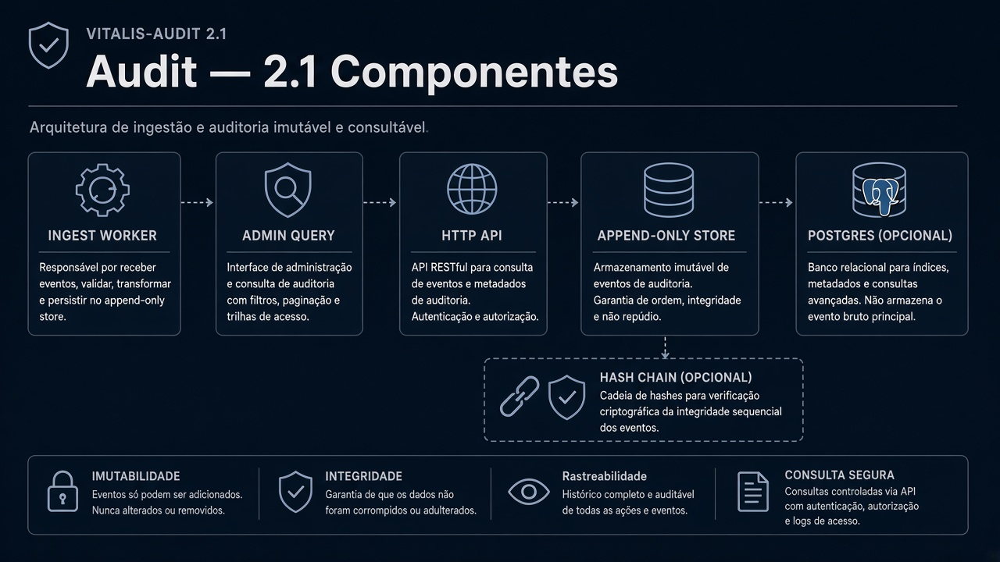
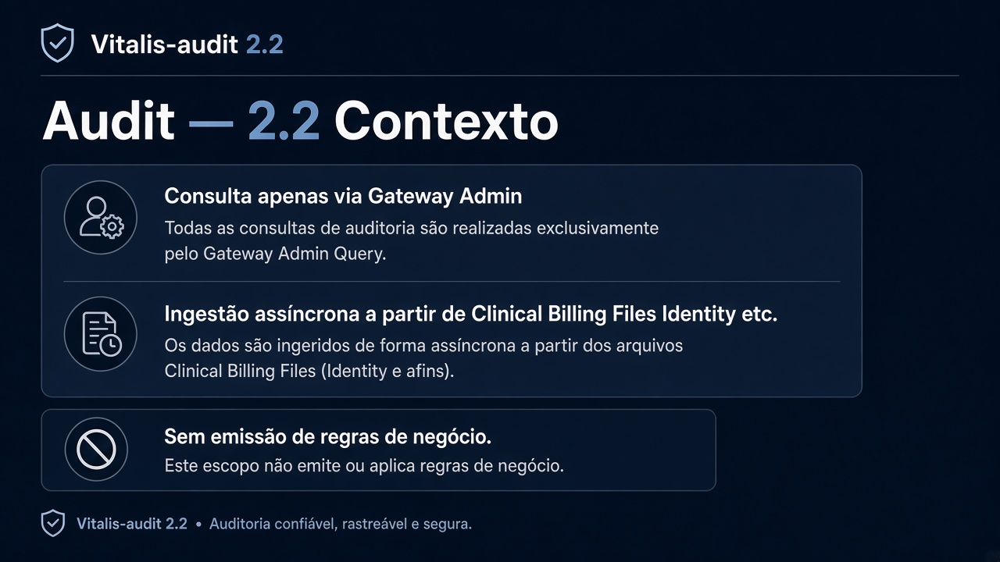
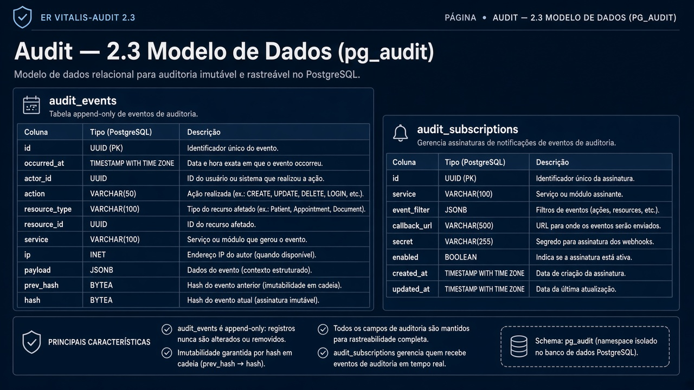
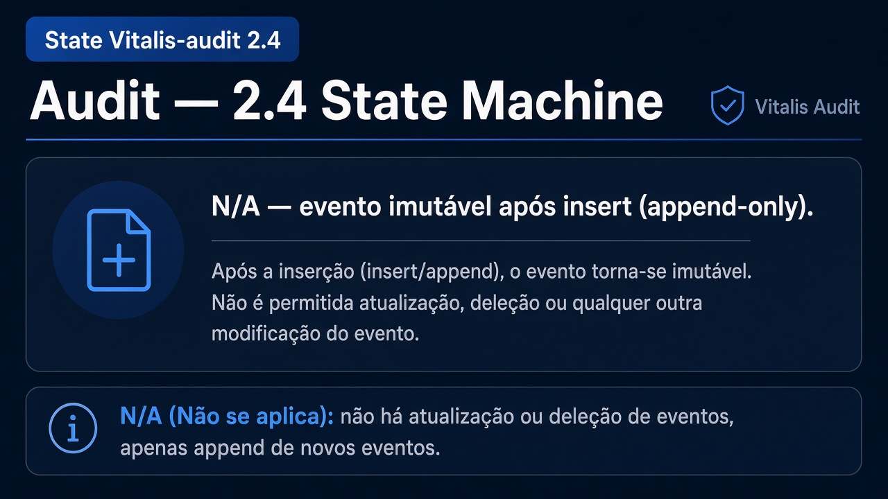
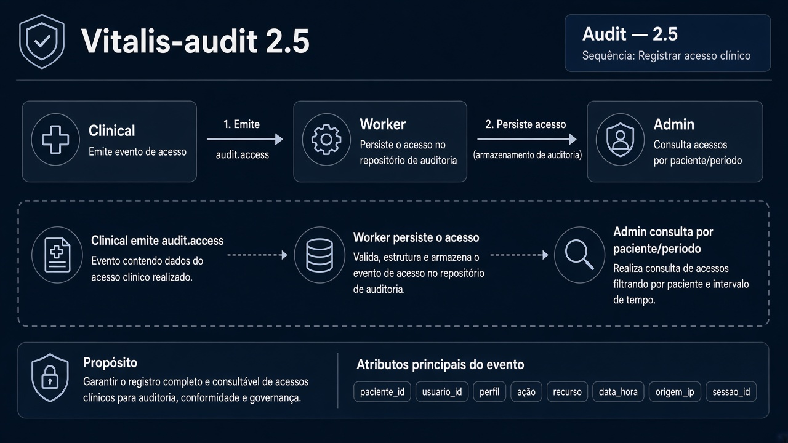
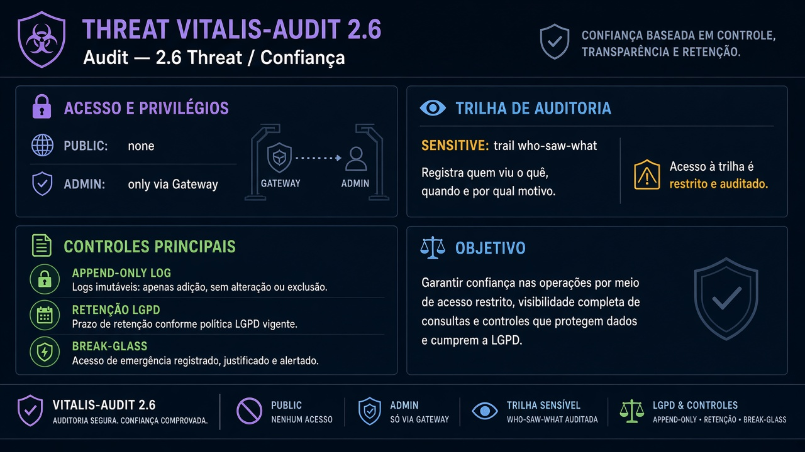

# Vitalis-audit — Diagramas 2.1 → 2.6

| Campo | Valor |
|---|---|
| Repo | `Vitalis-audit` |
| Porta | `8091` |
| DB | `pg_audit` |

---

## 2.1 Componentes

**Imagem:** audit-2.1-components.png

HTTP API (admin query) · Ingest worker (eventos) · Append-only store · Postgres · (opcional) hash chain

---

## 2.2 Contexto

**Imagem:** audit-2.2-context.png

| Dir | Parceiro | Tipo | Uso |
|---|---|---|---|
| ← | Gateway | sync | consulta admin |
| ← | Clinical, Billing, Files, Identity, … | async | ingestão |
| — | não emite regra de negócio | — | só trilha |

---

## 2.3 ER

**Imagem:** audit-2.3-er.png

- `audit_events` (id, occurred_at, actor_id, action, resource_type, resource_id, service, ip, payload, prev_hash, hash)
- `audit_subscriptions` (quais eventos escutar)

Append-only: sem UPDATE/DELETE de aplicação.

---

## 2.4 State

**Imagem:** audit-2.4-state.png

N/A — evento imutável após insert.

---

## 2.5 Sequência — Registrar acesso clínico

**Imagem:** audit-2.5-sequence.png

1. Clinical emite `audit.access`  
2. Worker persiste linha  
3. Admin consulta por paciente/período  

---

## 2.6 Threat

**Imagem:** audit-2.6-threat.png

| | |
|---|---|
| Público | nenhum (só admin via GW) |
| Sensível | a própria trilha (quem viu o quê) |
| Controles | append-only, retenção LGPD, acesso admin break-glass |
