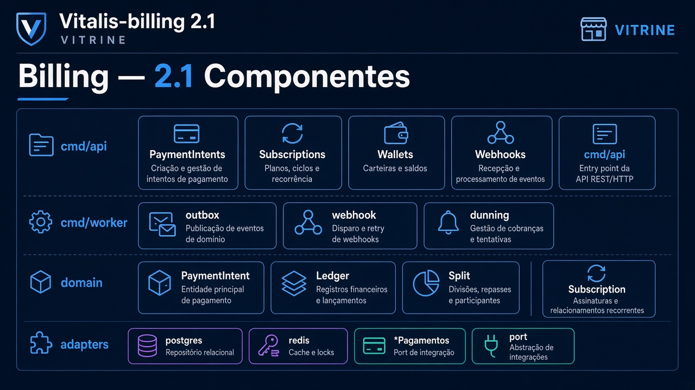
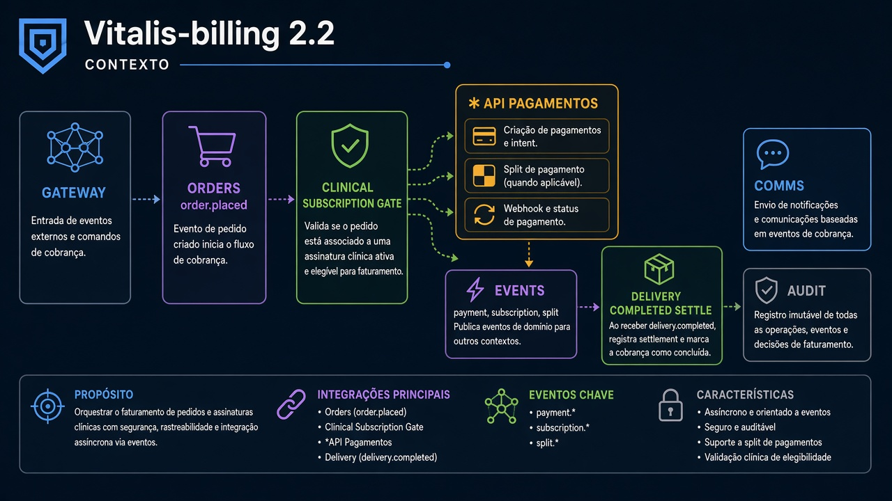
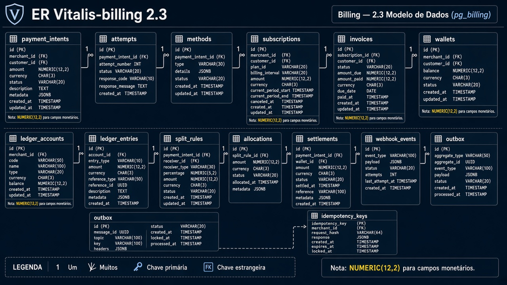
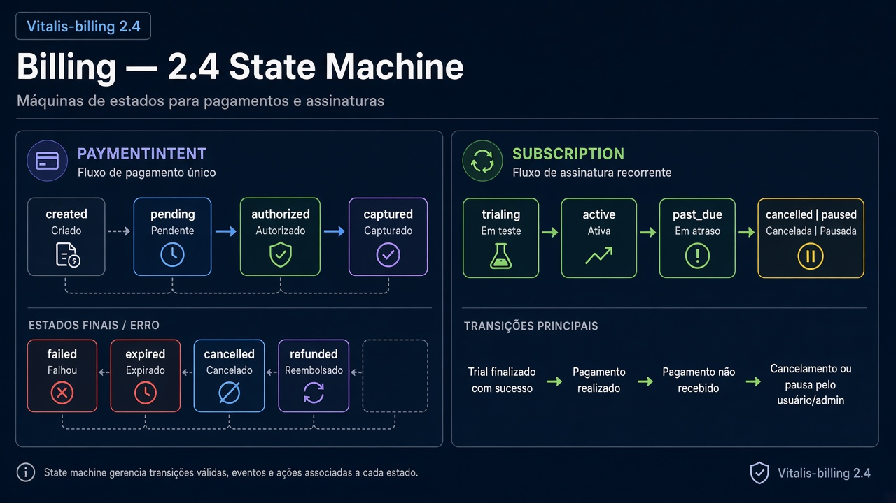
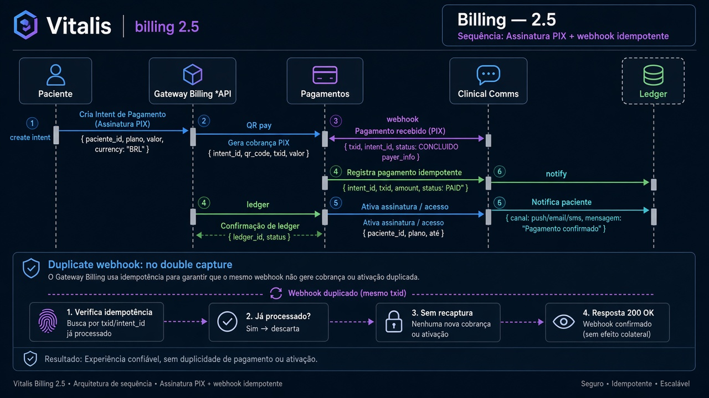
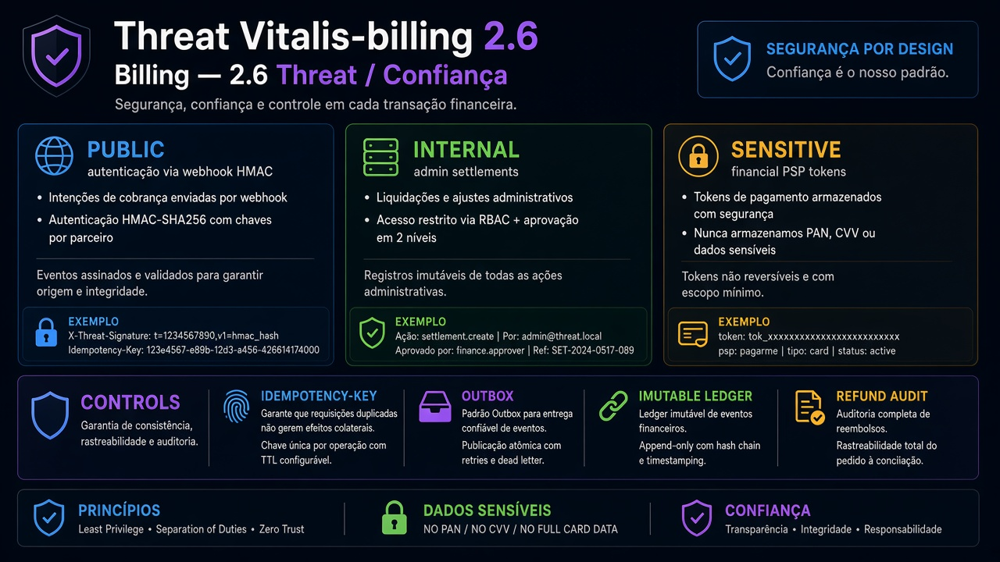

# Vitalis-billing — Diagramas 2.1 → 2.6

| Campo | Valor |
|---|---|
| Repo | `Vitalis-billing` |
| Porta | `8086` |
| DB | `pg_billing` |
| Destaque | **Serviço vitrine** |

---

## 2.1 Componentes



**Imagem:** billing-2.1-components.png


```
cmd/api          → HTTP (PaymentIntents, Subscriptions, Wallets, Webhooks)
cmd/worker       → outbox + webhook processor + dunning
internal/domain  → PaymentIntent, Ledger, Split, Subscription
internal/app     → Charge, ConfirmPIX, Renew, SettleSplit, Refund
adapters         → postgres, redis, *pagamentos (port), http
```

Ports: `PaymentProvider`, `EventBus`, `Clock`, `LedgerRepository`.

---

## 2.2 Contexto



**Imagem:** billing-2.2-context.png


| Dir | Parceiro | Tipo | Uso |
|---|---|---|---|
| ← | Gateway | sync | checkout, assinaturas, webhooks |
| ← | Orders | async | `order.placed` |
| ← | Clinical | sync | gate assinatura |
| → | * API Pagamentos | sync | PIX/cartão + webhooks |
| → | Redis | async | `payment.*`, `subscription.*`, `split.*` |
| ← | Delivery | async | `delivery.completed` → settle |
| → | Comms | async | falha/sucesso cobrança |
| → | Audit | async | trilha financeira |

---

## 2.3 ER



**Imagem:** billing-2.3-er.png


- `payment_intents`, `payment_attempts`, `payment_methods`
- `subscriptions`, `subscription_items`, `invoices`, `invoice_lines`
- `wallets`, `wallet_holds`
- `ledger_accounts`, `ledger_transactions`, `ledger_entries`
- `split_rules`, `split_allocations`
- `settlements`, `payouts`
- `webhook_events`, `outbox_events`, `idempotency_keys`

Dinheiro: `NUMERIC(12,2)` — nunca float.

---

## 2.4 State machines



**Imagem:** billing-2.4-state.png


**PaymentIntent:**  
`created` → `pending` → `authorized` → `captured`  
fail: `failed` | `expired` | `cancelled`  
post: `refunded` (parcial/total)

**Subscription:**  
`trialing` → `active` → `past_due` → `cancelled` | `paused`

---

## 2.5 Sequências



**Imagem:** billing-2.5-sequence.png


A) Assinatura PIX (ver macro 1.4a)  
B) Pedido com split (ver macro 1.4b)  
C) Webhook duplicado → idempotência → 1 ledger só  

---

## 2.6 Threat



**Imagem:** billing-2.6-threat.png


| | |
|---|---|
| Público | criar intent autenticado; webhook com HMAC |
| Interno | settlements admin |
| Sensível | financeiro, tokens PSP (sem PAN/CVV) |
| Controles | Idempotency-Key, outbox, ledger imutável, auditoria estorno |
