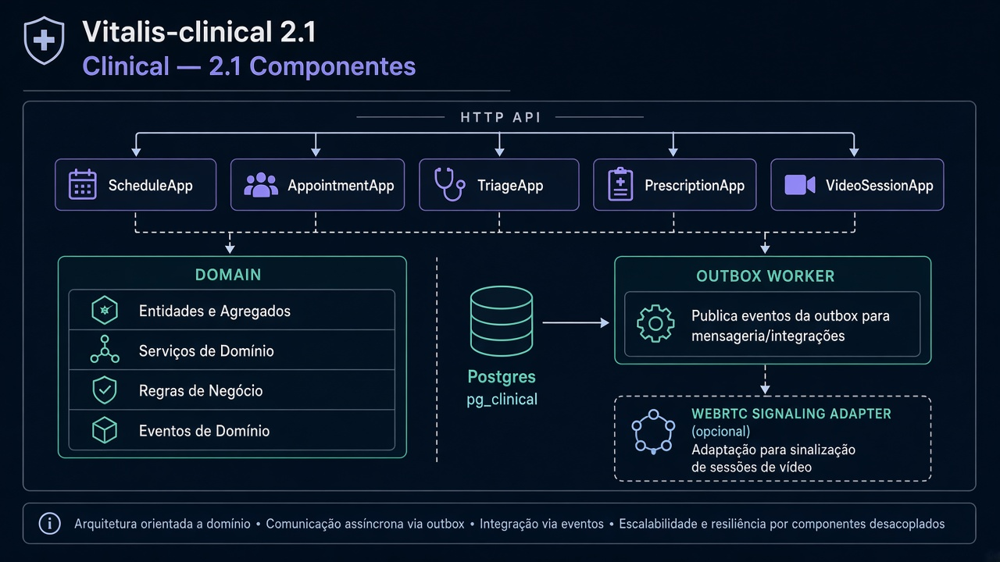
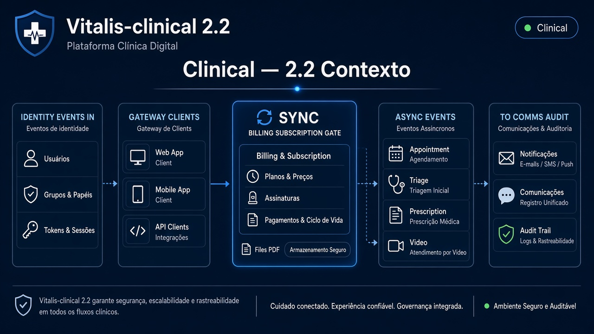
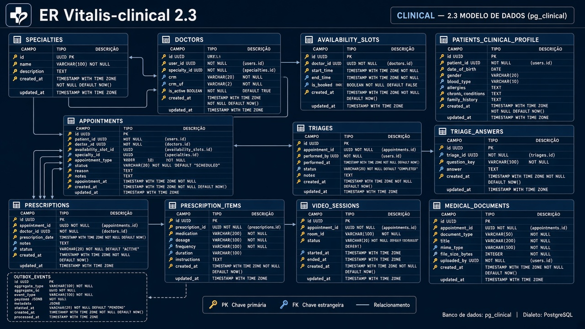
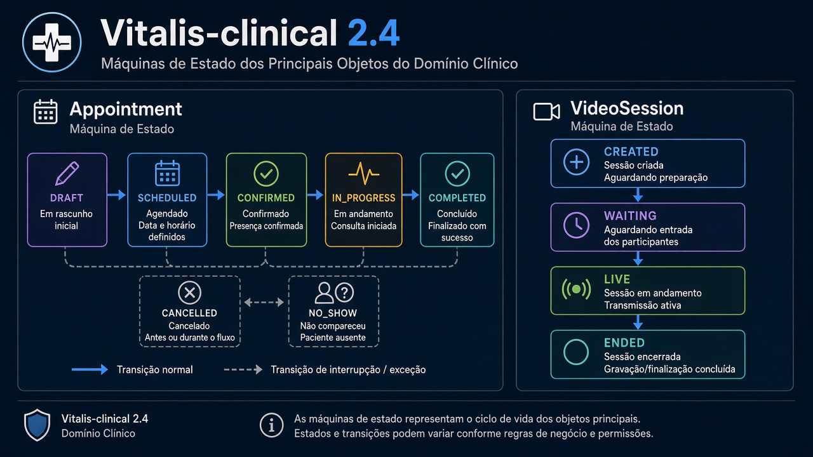
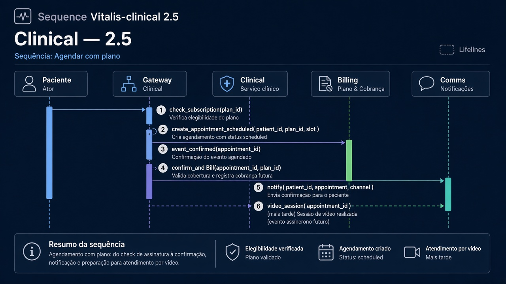
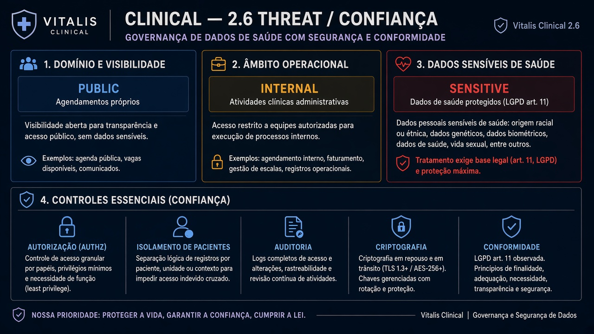

# Vitalis-clinical — Diagramas 2.1 → 2.6

| Campo | Valor |
|---|---|
| Repo | `Vitalis-clinical` |
| Porta | `8082` |
| DB | `pg_clinical` |
| Stack | Go + PostgreSQL |

---

## 2.1 Componentes

**Imagem:** clinical-2.1-components.png

API HTTP · App (Schedule, Appointments, Triage, Prescription, VideoSession) · Domain · Postgres · Outbox worker · (opcional) adapter sinalização WebRTC

---

## 2.2 Contexto

**Imagem:** clinical-2.2-context.png

| Dir | Parceiro | Tipo | Uso |
|---|---|---|---|
| ← | Gateway | sync | agenda, consulta, triagem, receita |
| → | Billing | sync | `GET assinatura ativa?` (gate plano) |
| → | Redis | async | `appointment.*`, `triage.completed`, `prescription.issued`, `video.session.*` |
| ← | Identity eventos | async | profissional verificado |
| → | Files | sync | anexar PDF receita |
| → | Audit | async | acesso a dado clínico |
| → | Comms | async | notificações |

---

## 2.3 ER

**Imagem:** clinical-2.3-er.png

- `specialties`, `doctors`, `doctor_availability_slots`
- `patients_clinical_profile` (refs user_id Identity — sem senha)
- `appointments`, `appointment_participants`
- `triages`, `triage_answers`
- `prescriptions`, `prescription_items`
- `video_sessions` (room_id, status)
- `medical_documents` (meta; blob em Files)
- `outbox_events`

---

## 2.4 State — Appointment

**Imagem:** clinical-2.4-state.png

`draft` → `scheduled` → `confirmed` → `in_progress` → `completed`  
alternates: `cancelled`, `no_show`

VideoSession: `created` → `waiting` → `live` → `ended`

---

## 2.5 Sequência — Agendar com plano ativo

**Imagem:** clinical-2.5-sequence.png

1. Paciente agenda slot  
2. Clinical consulta Billing (assinatura)  
3. Cria appointment `scheduled`  
4. Evento `appointment.confirmed` → Comms  
5. Na hora: cria video_session  

---

## 2.6 Threat

**Imagem:** clinical-2.6-threat.png

| | |
|---|---|
| Público via GW | leitura agenda própria; criar consulta |
| Interno | jobs, admin clínico |
| **Dados sensíveis** | saúde (LGPD art. 11) — maior classificação |
| Controles | authz paciente≠ver outro; audit log; encryption at rest |
