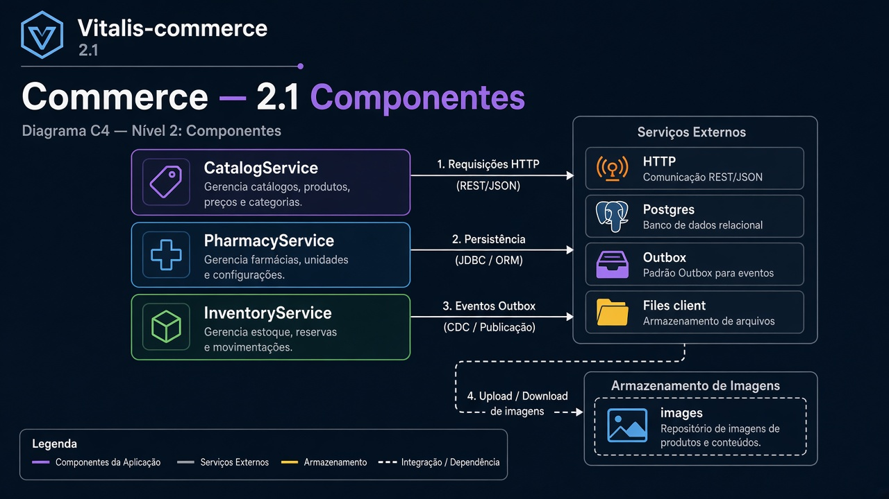
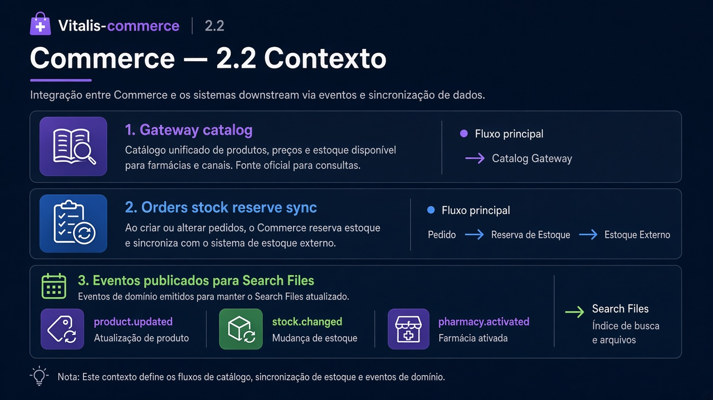
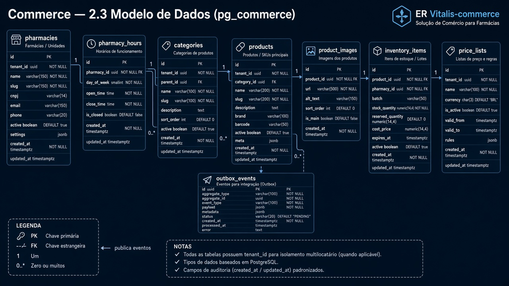
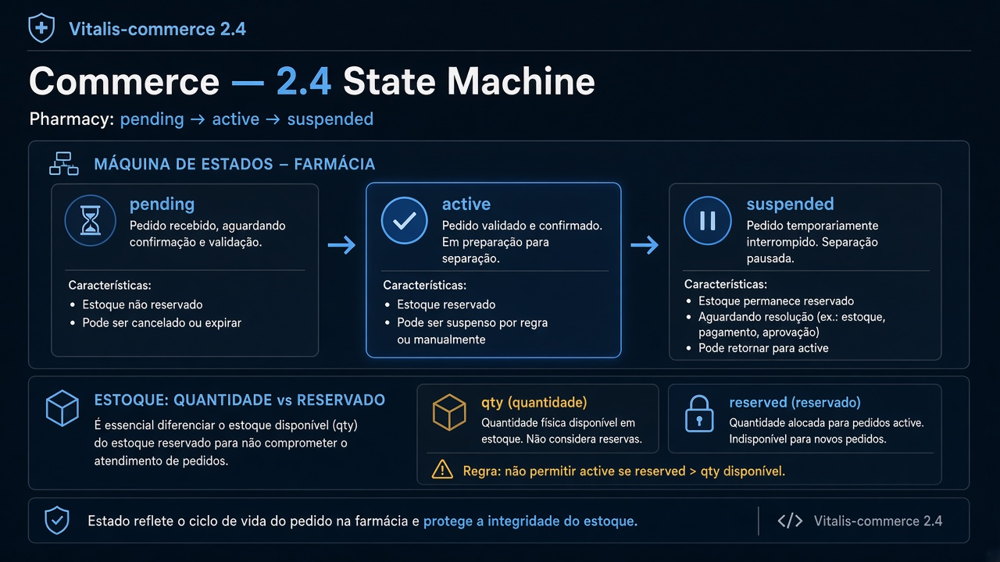
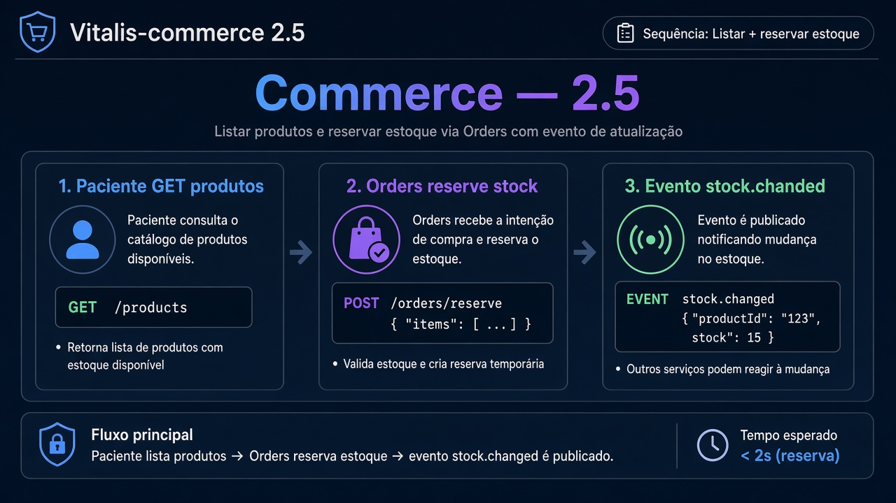
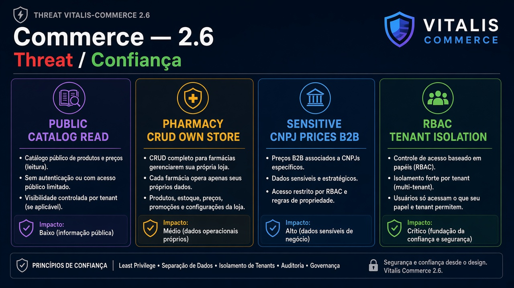

# Vitalis-commerce — Diagramas 2.1 → 2.6

| Campo | Valor |
|---|---|
| Repo | `Vitalis-commerce` |
| Porta | `8083` |
| DB | `pg_commerce` |

---

## 2.1 Componentes

**Imagem:** commerce-2.1-components.png

HTTP API · CatalogService · PharmacyService · InventoryService · Postgres · Outbox · Files client (imagens produto)

---

## 2.2 Contexto

**Imagem:** commerce-2.2-context.png

| Dir | Parceiro | Tipo | Uso |
|---|---|---|---|
| ← | Gateway | sync | catálogo paciente/farmácia |
| ← | Orders | sync | reserva/consulta estoque |
| → | Redis | async | `product.updated`, `stock.changed`, `pharmacy.activated` |
| → | Files | sync | URL imagem |
| → | Search | async | indexar produto |

---

## 2.3 ER

**Imagem:** commerce-2.3-er.png

- `pharmacies`, `pharmacy_hours`
- `categories`, `products`, `product_images`
- `inventory_items` (pharmacy_id, product_id, qty, reserved)
- `price_lists`
- `outbox_events`

---

## 2.4 State — Pharmacy

**Imagem:** commerce-2.4-state.png

`pending` → `active` → `suspended`

Inventory: qty disponível vs `reserved` (não state machine pesada).

---

## 2.5 Sequência — Listar produtos + reservar

**Imagem:** commerce-2.5-sequence.png

1. GET produtos (paciente)  
2. Orders chama reserve stock  
3. Evento `stock.changed`  

---

## 2.6 Threat

**Imagem:** commerce-2.6-threat.png

| | |
|---|---|
| Público | catálogo leitura |
| Interno/farmácia | CRUD produto, estoque |
| Sensível | preços B2B, dados CNPJ farmácia |
| Controles | RBAC farmacia só na própria loja |
