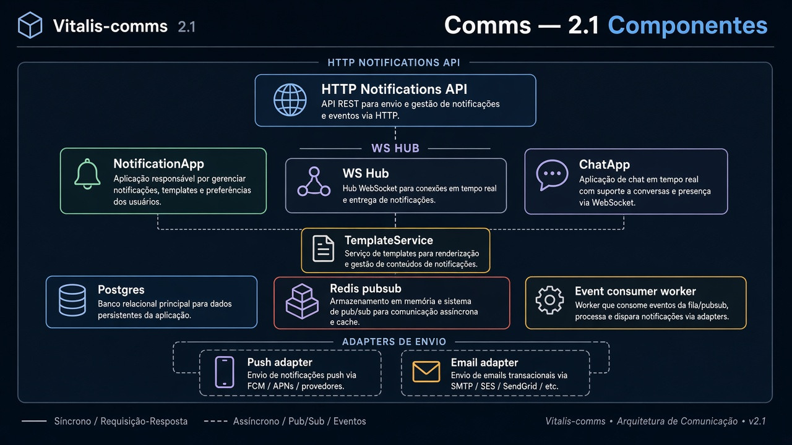
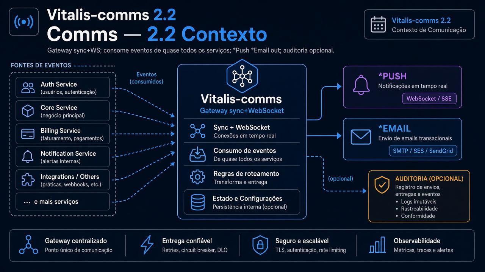
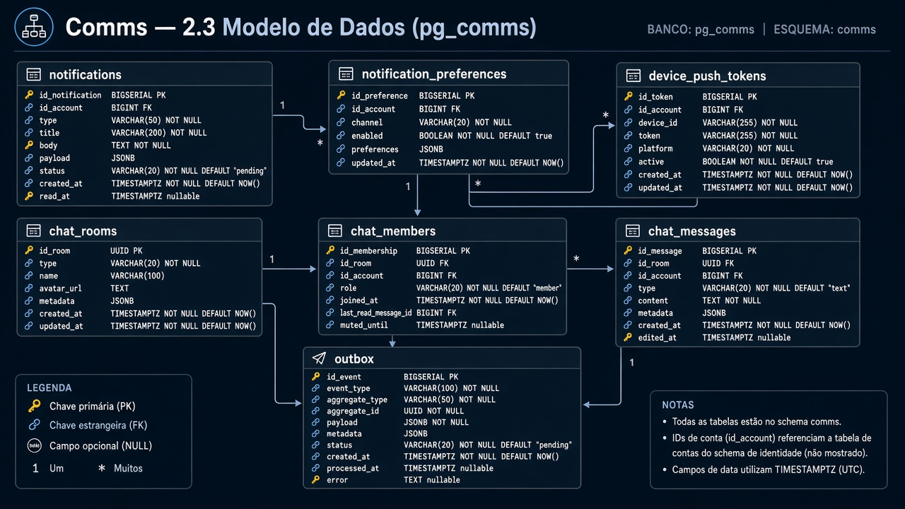
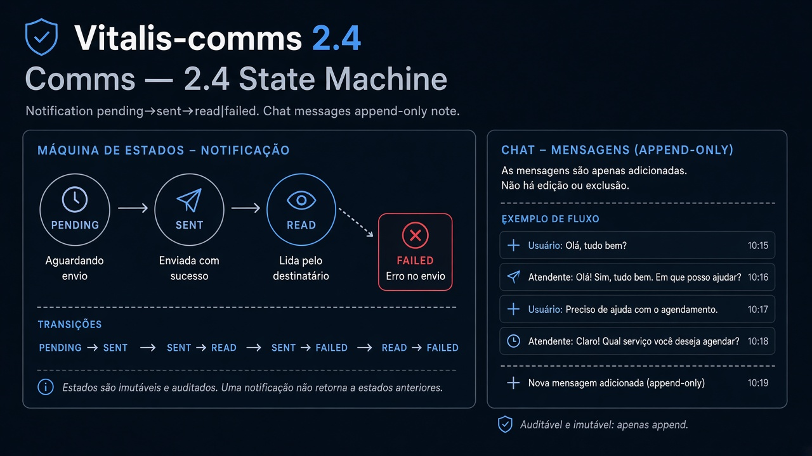
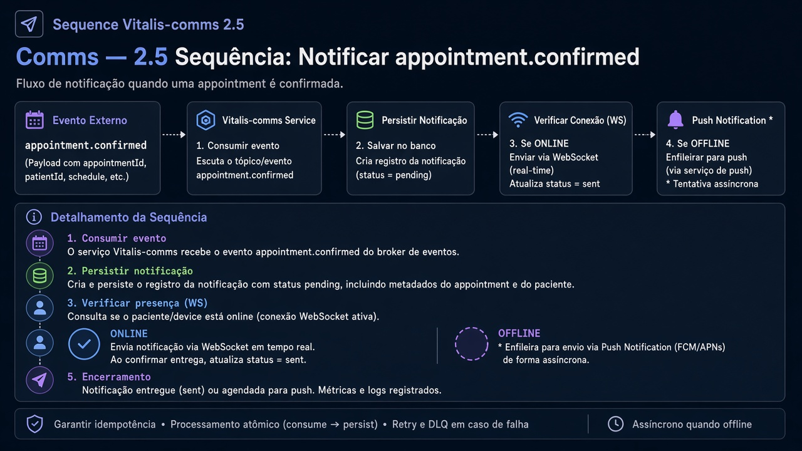
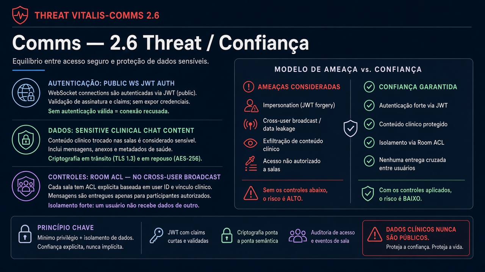

# Vitalis-comms — Diagramas 2.1 → 2.6

| Campo | Valor |
|---|---|
| Repo | `Vitalis-comms` |
| Porta | `8087` |
| DB | `pg_comms` |

---

## 2.1 Componentes

**Imagem:** comms-2.1-components.png

HTTP API (notificações) · WS Hub (gorilla/nhooyr) · NotificationApp · ChatApp · TemplateService · Postgres · Redis pub/sub · adapters `* Push` / `* Email` · Event consumers worker

---

## 2.2 Contexto

**Imagem:** comms-2.2-context.png

| Dir | Parceiro | Tipo | Uso |
|---|---|---|---|
| ← | Gateway | sync + WS | clientes |
| ← | quase todos | async | fan-out eventos |
| → | * Push / * Email | sync | canais |
| → | Audit | async | opcional |

---

## 2.3 ER

**Imagem:** comms-2.3-er.png

- `notifications` (user_id, type, body, read_at)
- `notification_preferences`
- `chat_rooms`, `chat_members`, `chat_messages`
- `device_push_tokens`
- `outbox_events` (acks)

---

## 2.4 State

**Imagem:** comms-2.4-state.png

Notification: `pending` → `sent` → `read` | `failed`  
Chat message: append-only (sem SM pesada)

---

## 2.5 Sequência — Notificar appointment.confirmed

**Imagem:** comms-2.5-sequence.png

1. Consome evento  
2. Persiste notification  
3. WS push se online  
4. * Push se offline  

---

## 2.6 Threat

**Imagem:** comms-2.6-threat.png

| | |
|---|---|
| Público | WS autenticado JWT |
| Sensível | conteúdo chat clínico |
| Controles | room ACL; não broadcast cross-user |
