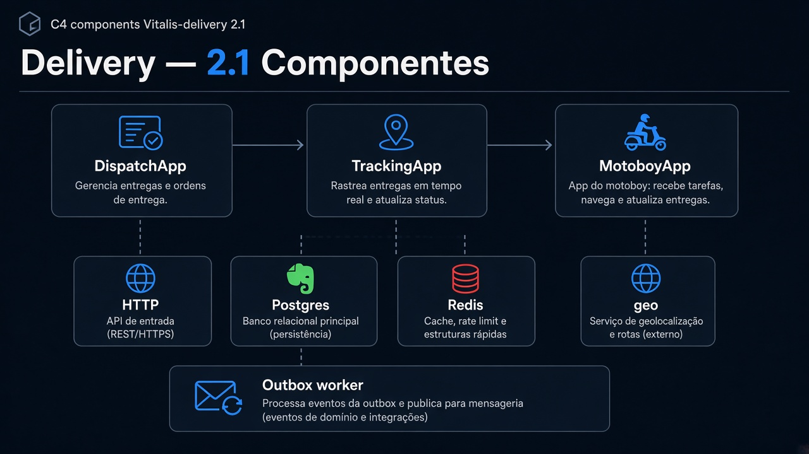
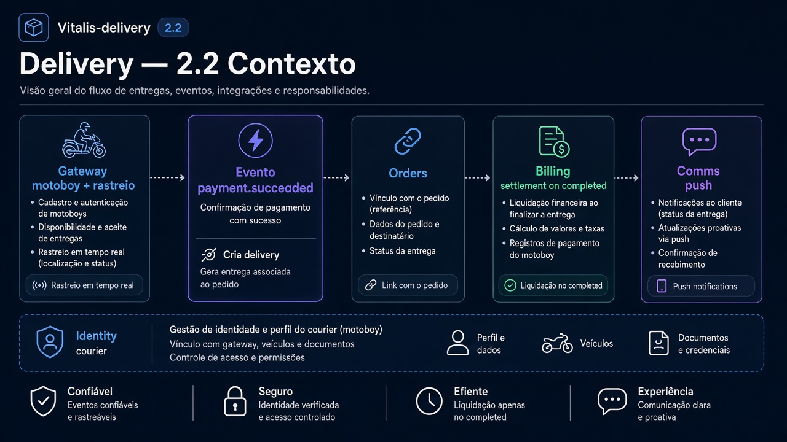
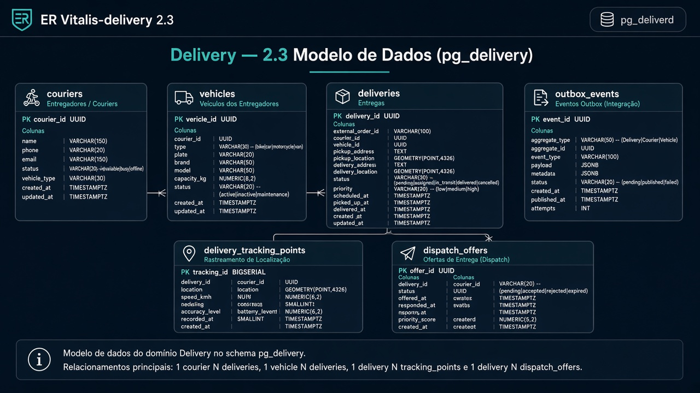
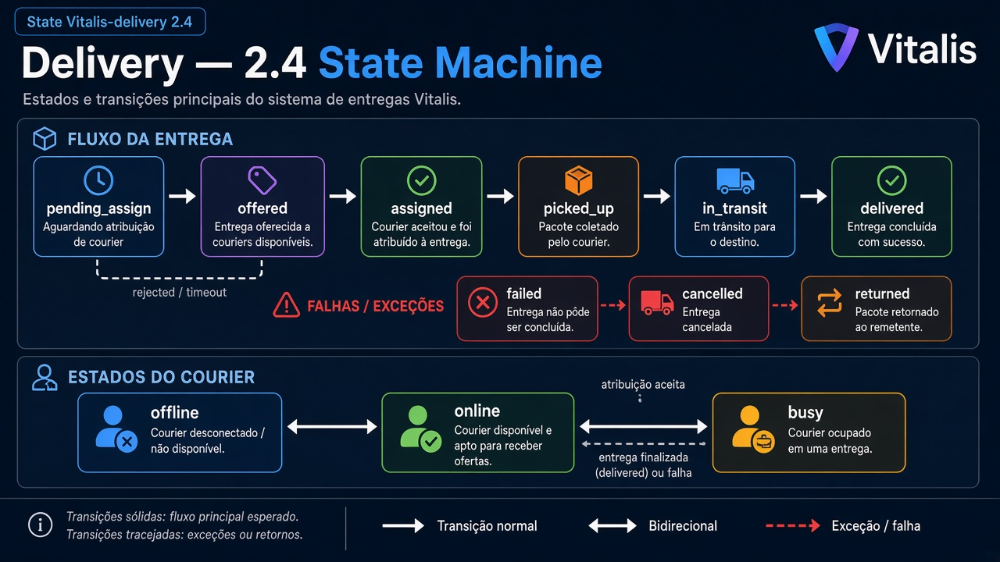
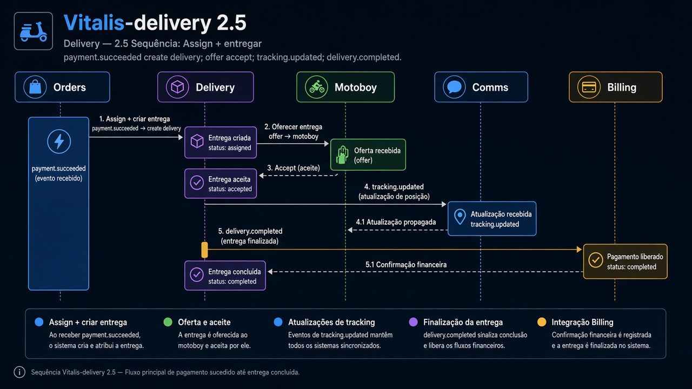
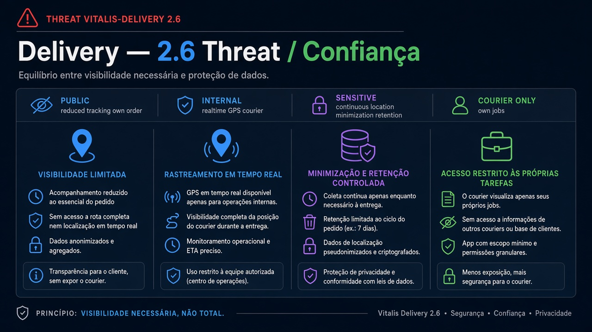

# Vitalis-delivery — Diagramas 2.1 → 2.6

| Campo | Valor |
|---|---|
| Repo | `Vitalis-delivery` |
| Porta | `8085` |
| DB | `pg_delivery` |

---

## 2.1 Componentes

**Imagem:** delivery-2.1-components.png

HTTP API · DispatchApp · TrackingApp · MotoboyApp · Postgres · Redis (presença/geo opcional) · Outbox worker

---

## 2.2 Contexto

**Imagem:** delivery-2.2-context.png

| Dir | Parceiro | Tipo | Uso |
|---|---|---|---|
| ← | Gateway | sync | motoboy app + paciente rastreio |
| ← | Orders/Billing eventos | async | criar entrega quando paid |
| → | Orders | sync/async | vínculo / status |
| → | Billing | async | `delivery.completed` → settlement |
| → | Comms | async | push corrida/rastreio |
| → | Identity | sync | perfil motoboy |

---

## 2.3 ER

**Imagem:** delivery-2.3-er.png

- `couriers` (user_id, status, vehicle_id)
- `vehicles`
- `deliveries` (order_id, courier_id, status)
- `delivery_tracking_points` (lat, lng, ts)
- `dispatch_offers`
- `outbox_events`

---

## 2.4 State — Delivery

**Imagem:** delivery-2.4-state.png

`pending_assign` → `offered` → `assigned` → `picked_up` → `in_transit` → `delivered`  
alternates: `failed`, `cancelled`, `returned`

Courier: `offline` ↔ `online` ↔ `busy`

---

## 2.5 Sequência — Assign + entregar

**Imagem:** delivery-2.5-sequence.png

1. `payment.succeeded` → cria delivery  
2. Offer → motoboy aceita  
3. Tracking updates → Comms  
4. `delivery.completed`  

---

## 2.6 Threat

**Imagem:** delivery-2.6-threat.png

| | |
|---|---|
| Público | rastreio do próprio pedido (pontos reduzidos) |
| Interno | localização realtime motoboy |
| Sensível | GPS contínuo — minimização/retenção |
| Controles | motoboy só vê corridas dele |
