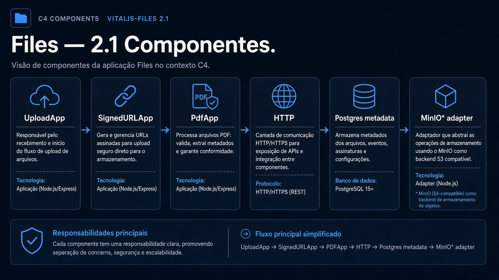
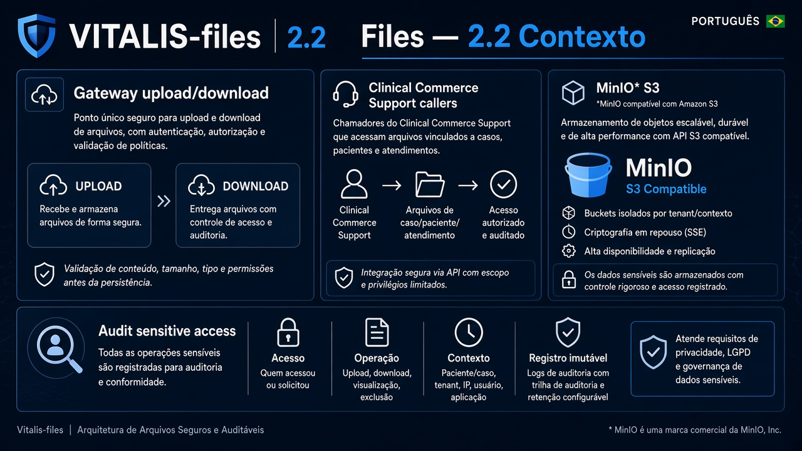
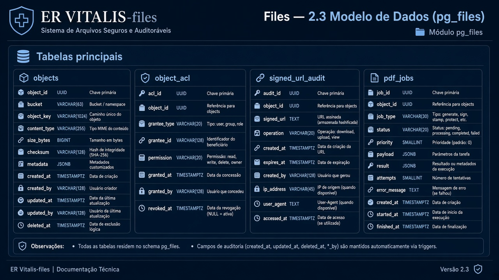
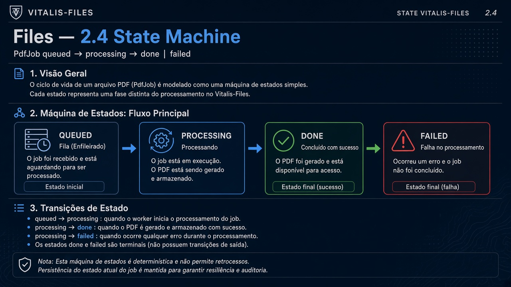
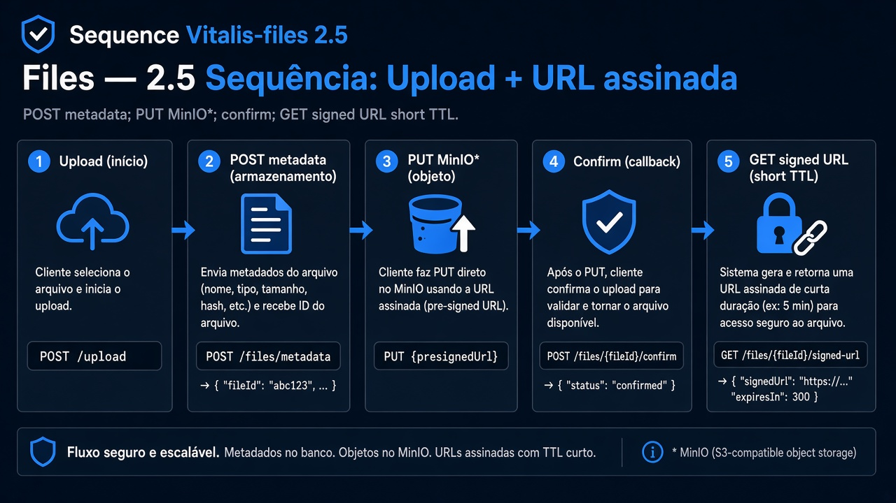
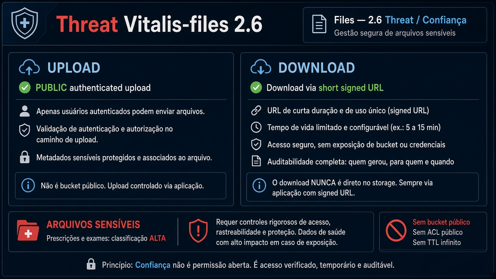

# Vitalis-files — Diagramas 2.1 → 2.6

| Campo | Valor |
|---|---|
| Repo | `Vitalis-files` |
| Porta | `8089` |
| DB | `pg_files` |
| Object store | MinIO\* |

---

## 2.1 Componentes

**Imagem:** files-2.1-components.png

HTTP API · UploadApp · SignedURLApp · PdfApp · Postgres metadata · MinIO\* adapter · virus-scan hook (futuro)

---

## 2.2 Contexto

**Imagem:** files-2.2-context.png

| Dir | Parceiro | Tipo | Uso |
|---|---|---|---|
| ← | Gateway | sync | upload/download |
| ← | Clinical/Commerce/Support | sync | anexos |
| → | MinIO\* | sync | S3 API |
| → | Audit | async | acesso a arquivo sensível |

---

## 2.3 ER

**Imagem:** files-2.3-er.png

- `objects` (id, bucket, key, mime, size, owner_id, classification)
- `object_acl`
- `signed_url_audit`
- `pdf_jobs`

---

## 2.4 State — PdfJob

**Imagem:** files-2.4-state.png

`queued` → `processing` → `done` | `failed`

---

## 2.5 Sequência — Upload + URL assinada

**Imagem:** files-2.5-sequence.png

1. POST metadata → recebe upload URL  
2. Cliente PUT no MinIO\*  
3. Confirm → GET signed URL temporária  

---

## 2.6 Threat

**Imagem:** files-2.6-threat.png

| | |
|---|---|
| Público | upload autenticado; download via URL assinada curta |
| Sensível | exames/receitas = classificação alta |
| Controles | TTL URL, ACL, sem bucket público |
