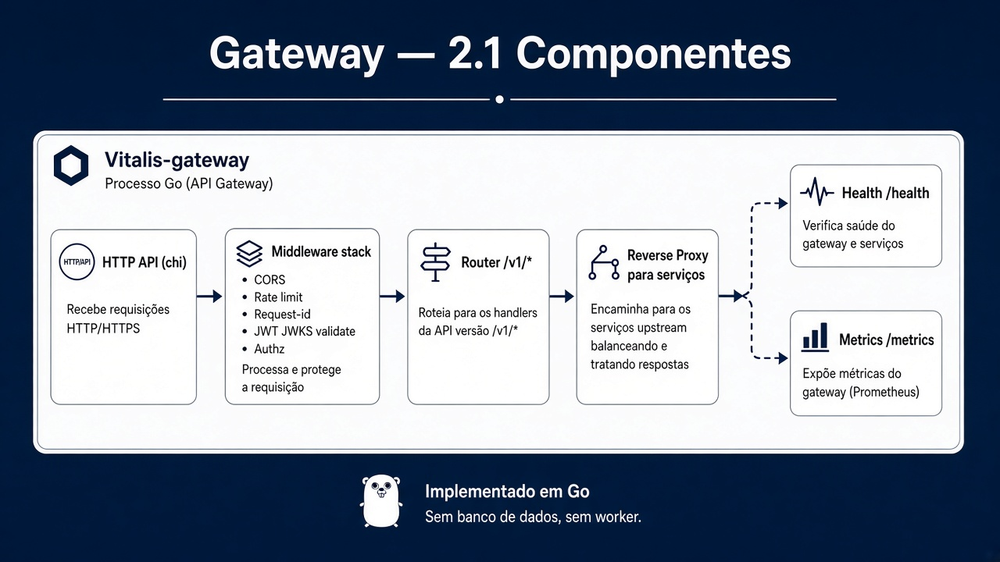
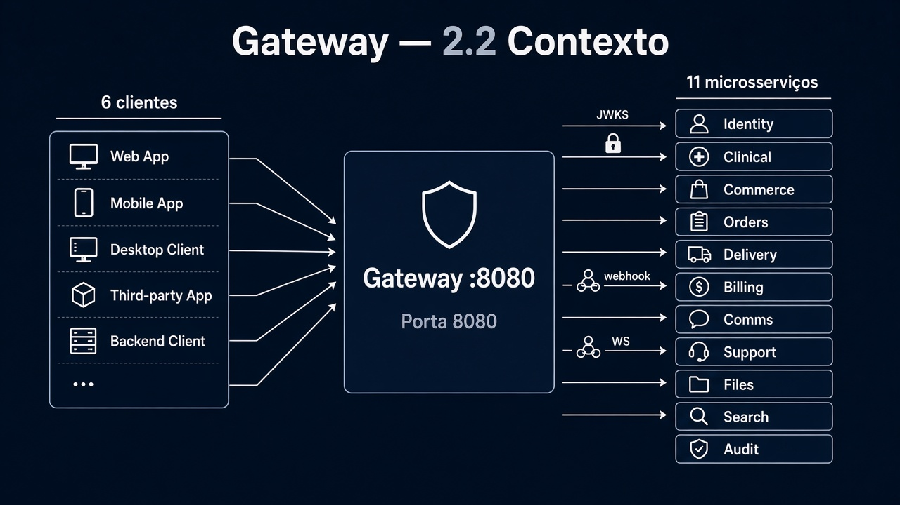
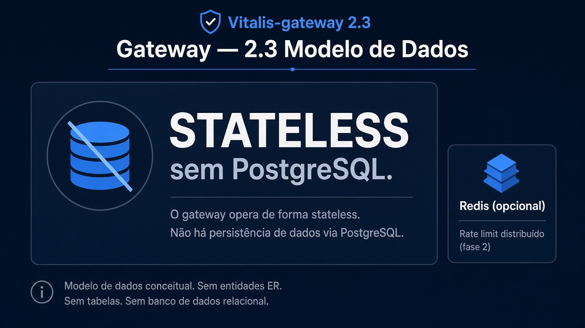
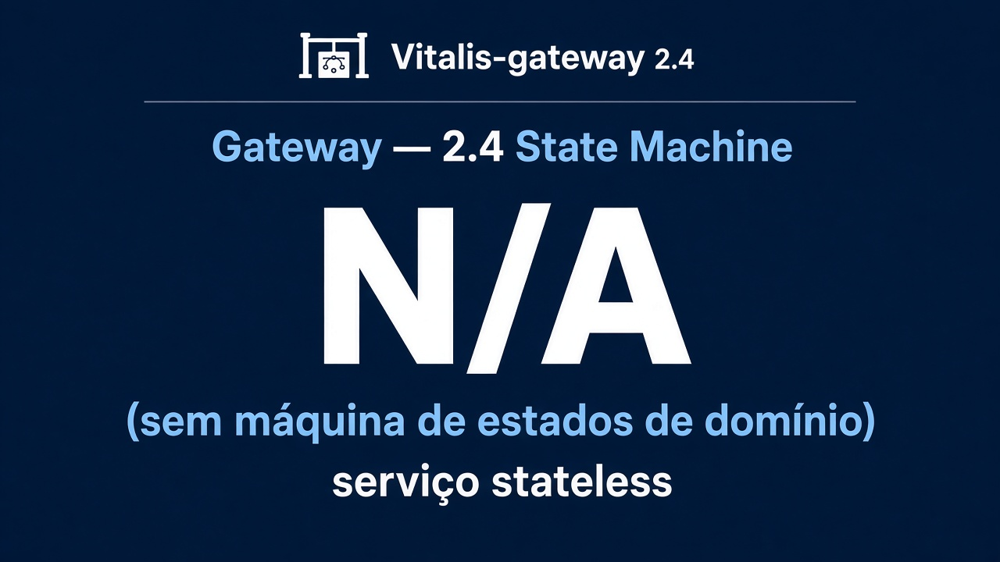
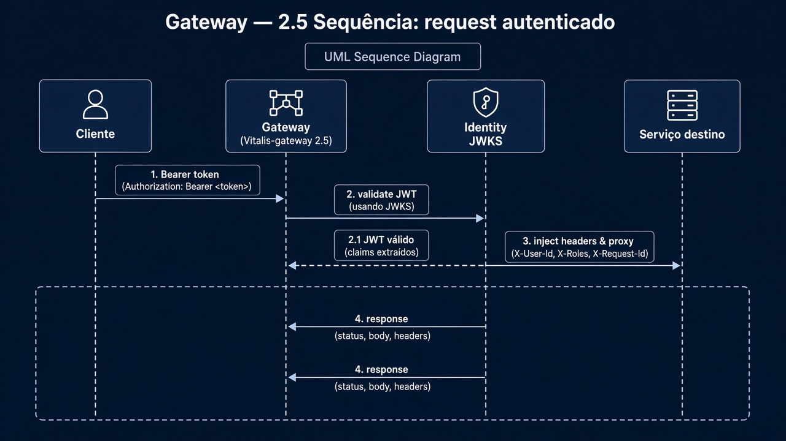
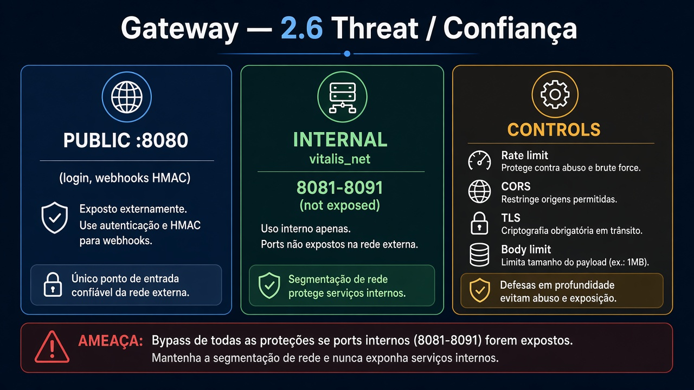

# Vitalis-gateway — Diagramas 2.1 → 2.6

| Campo | Valor |
|---|---|
| Repo | `Vitalis-gateway` |
| Porta | `8080` |
| Stack | Go |
| Database | nenhum (stateless) |

---

## 2.1 C4 Componentes



**Imagem:** gateway-2.1-components.png


```
┌─────────────────────────────────────────────┐
│                 Gateway (Go)                │
│  ┌──────────┐  ┌──────────┐  ┌───────────┐  │
│  │ HTTP API │→ │ Middleware│→ │ Router    │  │
│  │ (chi)    │  │ stack    │  │ /v1/*     │  │
│  └──────────┘  └──────────┘  └─────┬─────┘  │
│         middlewares:                    │   │
│         CORS · rate limit · request-id  │   │
│         JWT validate (JWKS Identity)    │   │
│         authz (roles claim)             │   │
│                                         ▼   │
│                               ┌─────────────┐│
│                               │ Reverse     ││
│                               │ Proxy       ││
│                               │ (por serviço││
│                               └─────────────┘│
│  ┌──────────┐  ┌──────────┐                 │
│  │ Health   │  │ Metrics  │                 │
│  │ /health  │  │ /metrics │                 │
│  └──────────┘  └──────────┘                 │
└─────────────────────────────────────────────┘
```

**Não tem:** worker, Postgres, regra de negócio.

---

## 2.2 Contexto do serviço



**Imagem:** gateway-2.2-context.png


| Direção | Parceiro | Tipo | Uso |
|---|---|---|---|
| ← | Todos os clientes web/mobile | sync HTTPS | Entrada única |
| → | Identity, Clinical, Commerce, Orders, Delivery, Billing, Comms, Support, Files, Search, Audit | sync HTTP | Proxy `/v1/...` |
| → | Identity JWKS | sync | Validar JWT |
| ← | * API Pagamentos (webhook) | sync | Encaminha para Billing (rota pública restrita) |
| → | Comms | WS upgrade | Proxy WebSocket |

---

## 2.3 Modelo de dados



**Imagem:** gateway-2.3-data.png


Sem Postgres. Estado só em memória/processo (rate-limit counters podem usar Redis compartilhado opcional).

| Store opcional | Uso |
|---|---|
| Redis | rate limit distribuído (fase 2) |

---

## 2.4 State machine



**Imagem:** gateway-2.4-state.png


N/A (stateless).

---

## 2.5 Sequência — request autenticado



**Imagem:** gateway-2.5-sequence.png


1. Cliente → Gateway `Authorization: Bearer`
2. Gateway valida JWT (exp, assinatura JWKS)
3. Injeta headers internos (`X-User-Id`, `X-Roles`, `X-Request-Id`)
4. Proxy → serviço destino
5. Resposta ← cliente

---

## 2.6 Threat / confiança



**Imagem:** gateway-2.6-threat.png


| Zona | O que |
|---|---|
| **Público** | `:8080` HTTPS; rotas login/cadastro; webhook pagamentos (assinatura HMAC) |
| **Interno** | rede dos microsserviços (não expor 8081–8091 em prod) |
| **Sensível** | JWT em trânsito; nunca logar token completo |
| **Controles** | rate limit, CORS allowlist, TLS, body size limit |

Ameaça principal: bypass de auth se proxy interno for exposto — mitiga com rede privada + mTLS futuro.
