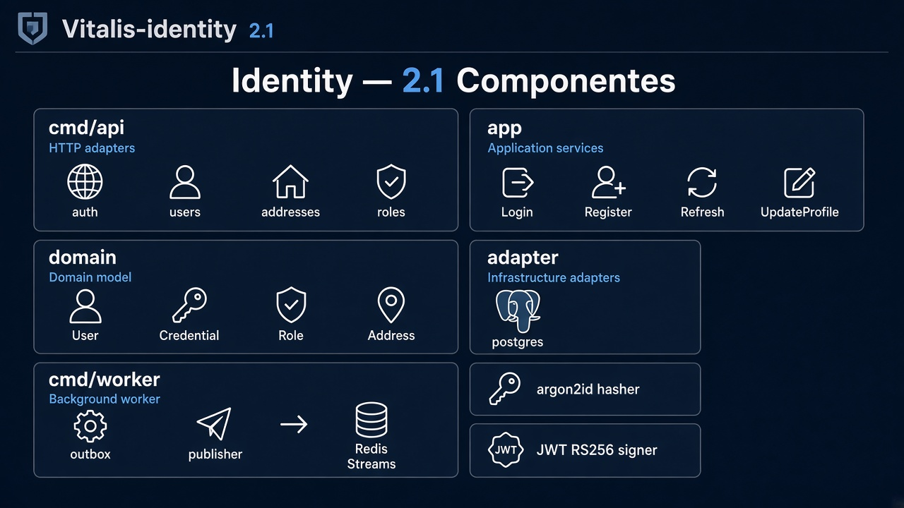
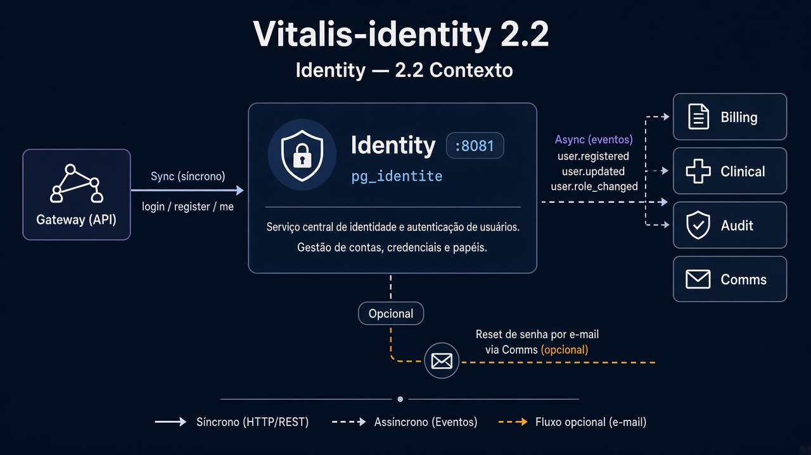
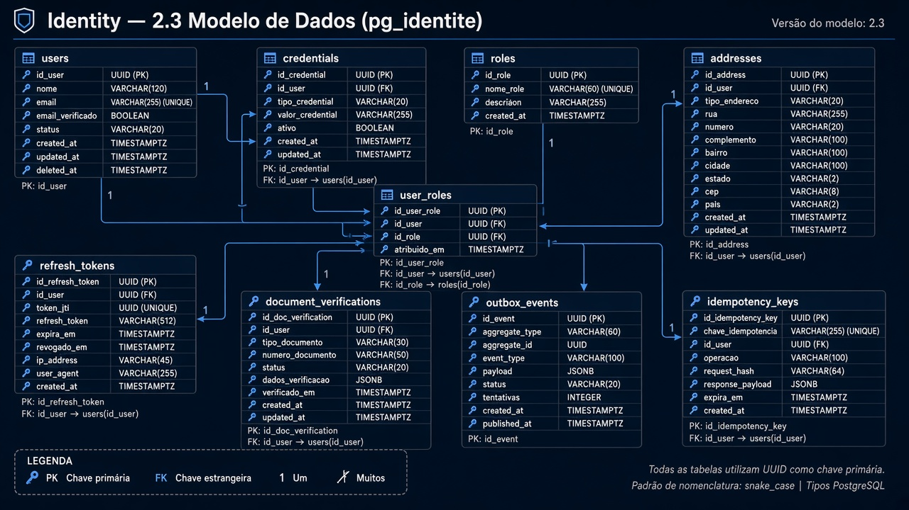
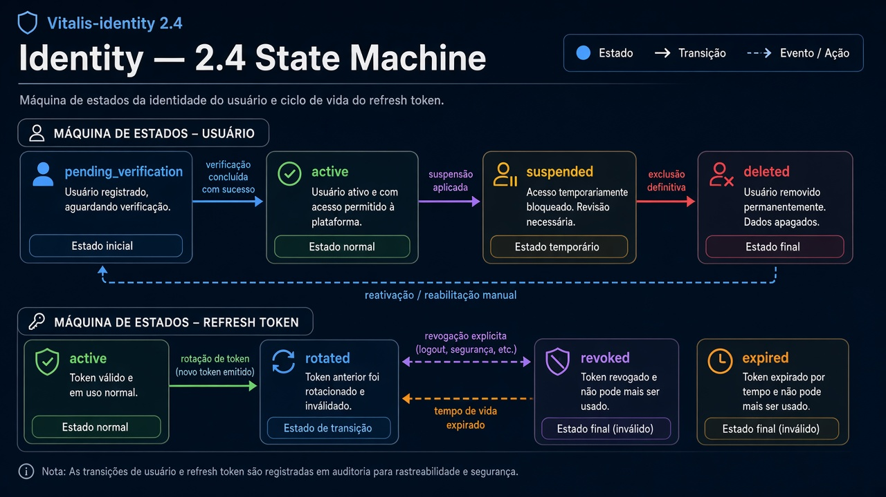
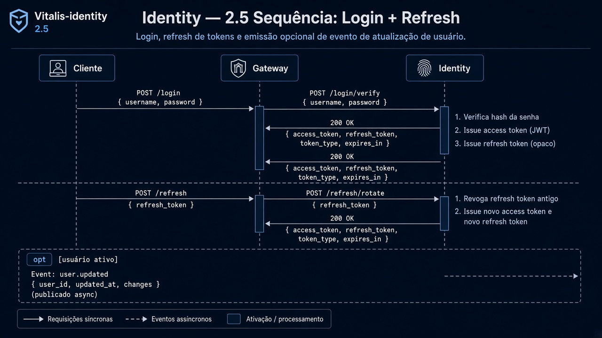
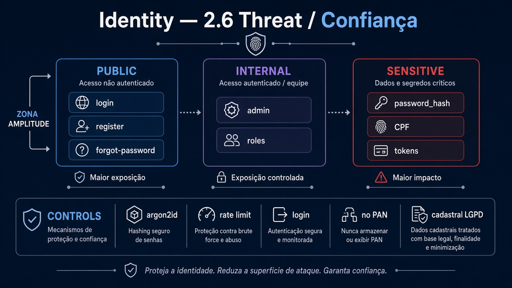

# Vitalis-identity — Diagramas 2.1 → 2.6

| Campo | Valor |
|---|---|
| Repo | `Vitalis-identity` |
| Porta | `8081` |
| Stack | Go + PostgreSQL |
| DB | `pg_identity` |

---

## 2.1 C4 Componentes



**Imagem:** identity-2.1-components.png


```
cmd/api
├── adapter/http (auth, users, addresses, roles)
├── app (Login, Register, Refresh, UpdateProfile)
├── domain (User, Credential, Role, Address)
└── adapter/postgres + redis(optional)

cmd/worker (opcional)
└── outbox publisher → Redis Streams
```

Adapters: HTTP, Postgres, (argon2id hasher), JWKS/JWT signer, Outbox.

---

## 2.2 Contexto



**Imagem:** identity-2.2-context.png


| Dir | Parceiro | Sync/Async | Uso |
|---|---|---|---|
| ← | Gateway | sync | login, register, /me |
| → | Redis outbox | async | `user.registered`, `user.updated`, `user.role_changed` |
| ← | Billing/Clinical/... | async consume? | não — Identity é source de identidade |
| → | * E-mail | sync via Comms ou direto | reset senha |

---

## 2.3 ER (principais)



**Imagem:** identity-2.3-er.png


- `users` (id, email, phone, status, created_at)
- `credentials` (user_id, password_hash, algo)
- `roles` / `user_roles` (paciente, medico, farmacia, motoboy, admin)
- `addresses` (user_id, cep, street, …)
- `refresh_tokens` (jti, user_id, expires_at, revoked)
- `document_verifications` (cpf/crm status)
- `outbox_events`
- `idempotency_keys`

---

## 2.4 State machine — User



**Imagem:** identity-2.4-state.png


`pending_verification` → `active` → `suspended` → `deleted` (soft)

Refresh token: `active` → `rotated` | `revoked` | `expired`

---

## 2.5 Sequência — Login + refresh



**Imagem:** identity-2.5-sequence.png


1. POST `/v1/auth/login` → verifica hash → emite access+refresh  
2. POST `/v1/auth/refresh` → rota refresh → novos tokens  
3. Evento `user.updated` se perfil mudar  

---

## 2.6 Threat



**Imagem:** identity-2.6-threat.png


| Zona | |
|---|---|
| Público | login, register, forgot-password |
| Interno | endpoints admin de roles |
| Sensível | password_hash, CPF, tokens |
| Controles | argon2id, rate limit login, sem PAN, LGPD base cadastral |
