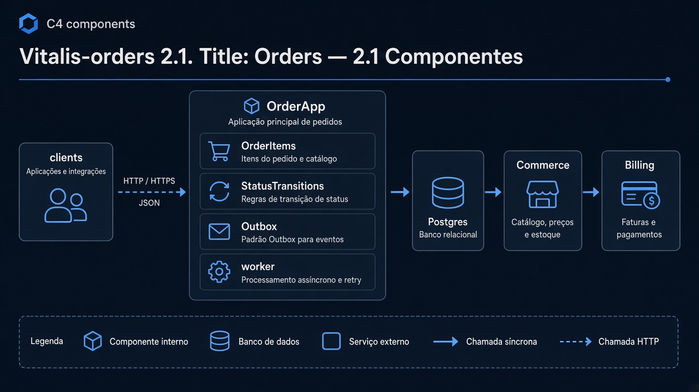
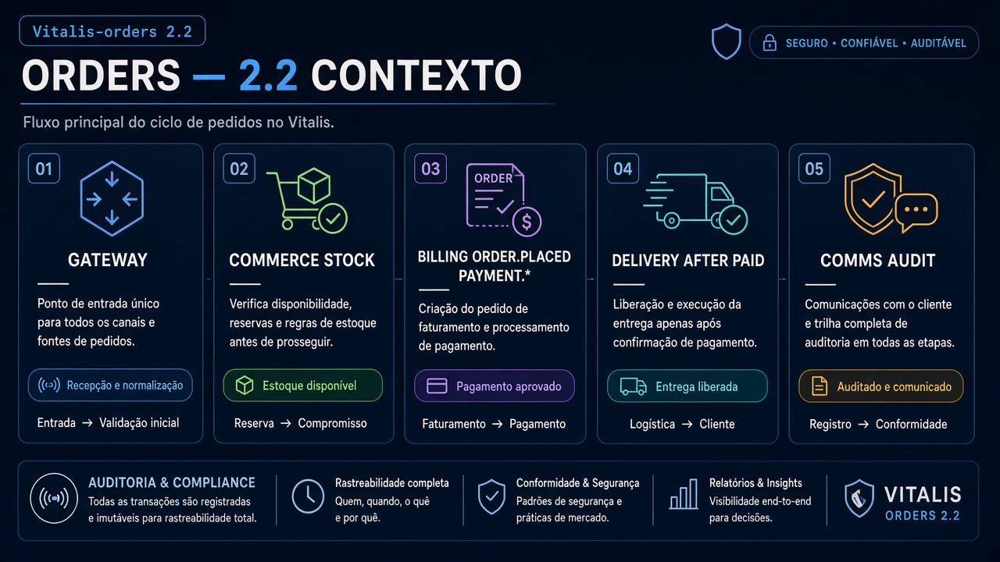
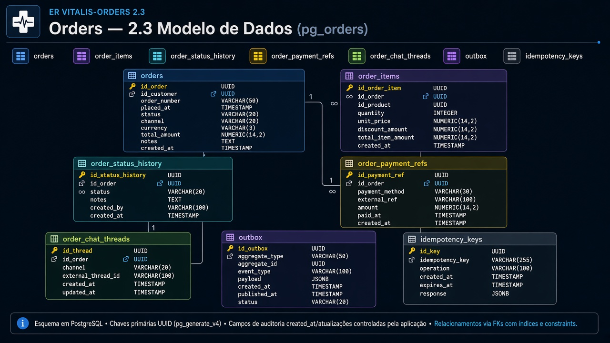
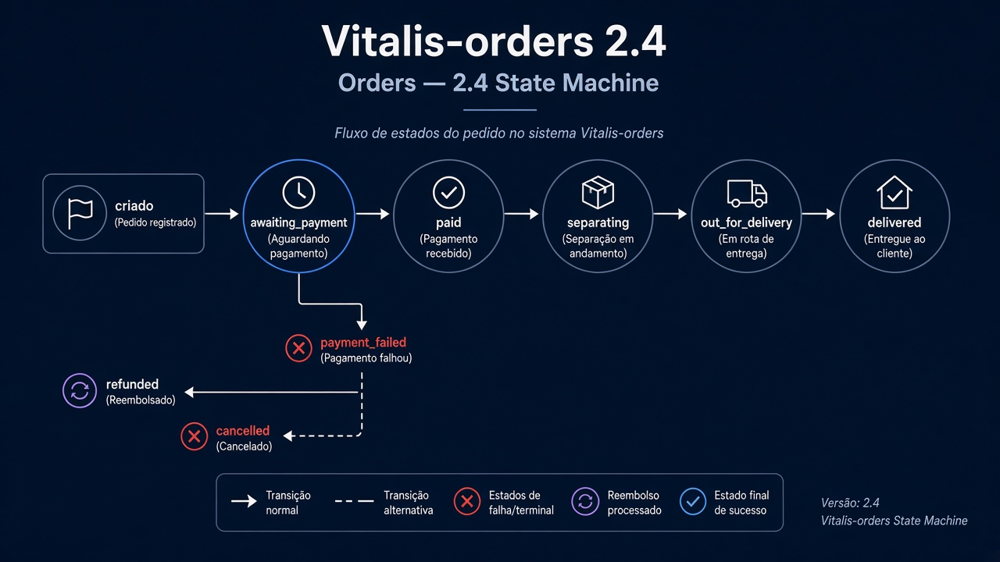
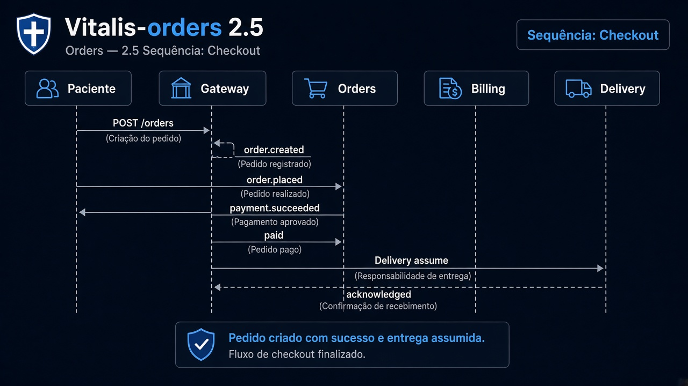
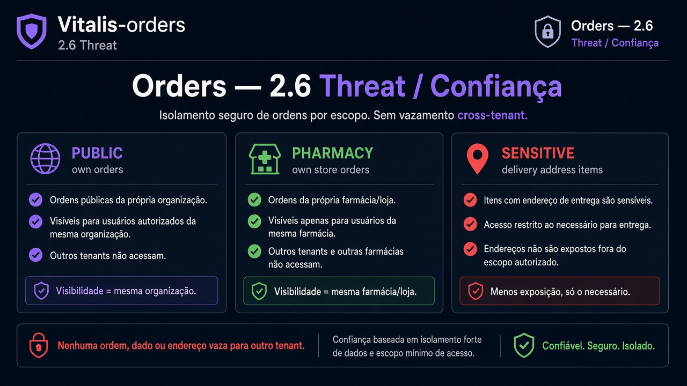

# Vitalis-orders — Diagramas 2.1 → 2.6

| Campo | Valor |
|---|---|
| Repo | `Vitalis-orders` |
| Porta | `8084` |
| DB | `pg_orders` |

---

## 2.1 Componentes

**Imagem:** orders-2.1-components.png

HTTP API · OrderApp · OrderItems · Status transitions · Outbox worker · Postgres · clients: Commerce, Billing

---

## 2.2 Contexto

**Imagem:** orders-2.2-context.png

| Dir | Parceiro | Tipo | Uso |
|---|---|---|---|
| ← | Gateway | sync | criar/listar pedido |
| → | Commerce | sync | estoque/catálogo |
| → | Billing | async+sync | `order.placed` / cobrança |
| ← | Billing | async | `payment.succeeded/failed` |
| → | Delivery | async | após paid |
| ← | Delivery | async | `delivery.completed` |
| → | Comms | async | status ao paciente |
| → | Audit | async | trilha |

---

## 2.3 ER

**Imagem:** orders-2.3-er.png

- `orders` (id, user_id, pharmacy_id, status, totals)
- `order_items` (product_id, qty, unit_price)
- `order_status_history`
- `order_payment_refs` (payment_intent_id)
- `order_chat_threads` (ref; msgs podem ficar Comms)
- `outbox_events`, `idempotency_keys`

---

## 2.4 State — Order

**Imagem:** orders-2.4-state.png

`created` → `awaiting_payment` → `paid` → `separating` → `out_for_delivery` → `delivered`  
alternates: `cancelled`, `payment_failed`, `refunded`

---

## 2.5 Sequência — Checkout pedido

**Imagem:** orders-2.5-sequence.png

1. POST pedido → `created`  
2. Evento `order.placed` → Billing  
3. `payment.succeeded` → `paid`  
4. Delivery assume  

---

## 2.6 Threat

**Imagem:** orders-2.6-threat.png

| | |
|---|---|
| Público | pedidos do próprio user |
| Interno | farmácia vê pedidos dela |
| Sensível | endereço entrega, itens RX-related |
| Controles | não vazar pedido cross-tenant |
