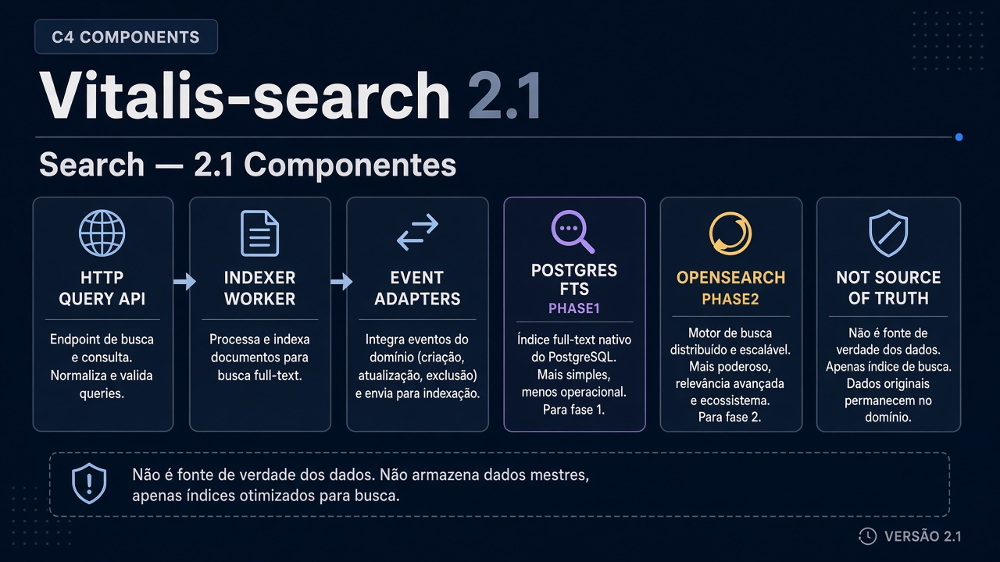
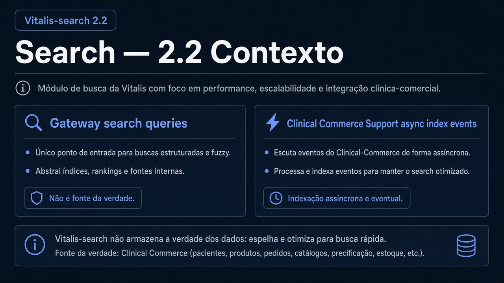
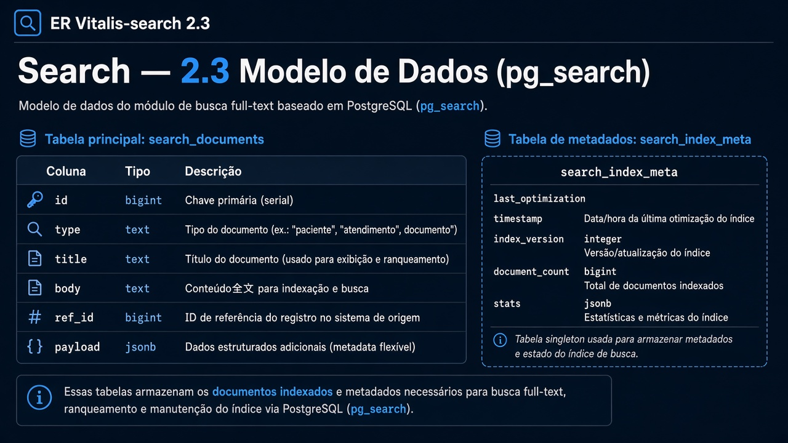
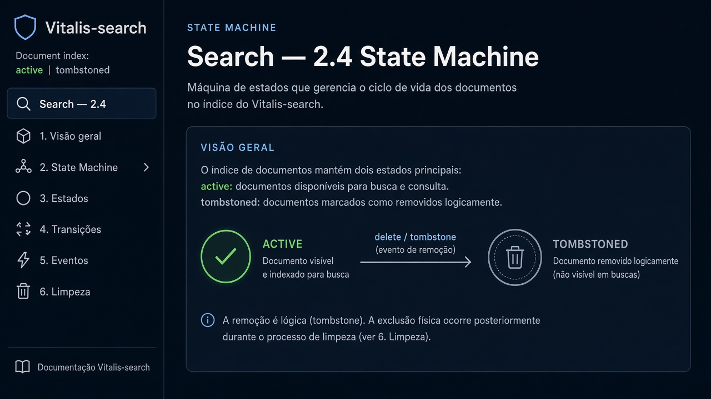
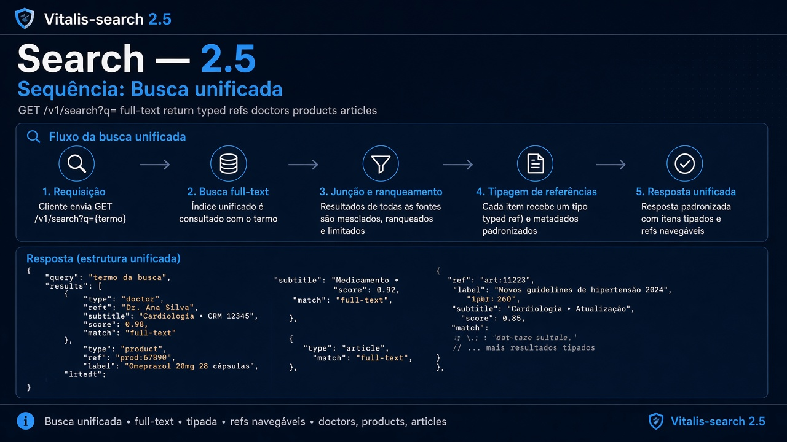
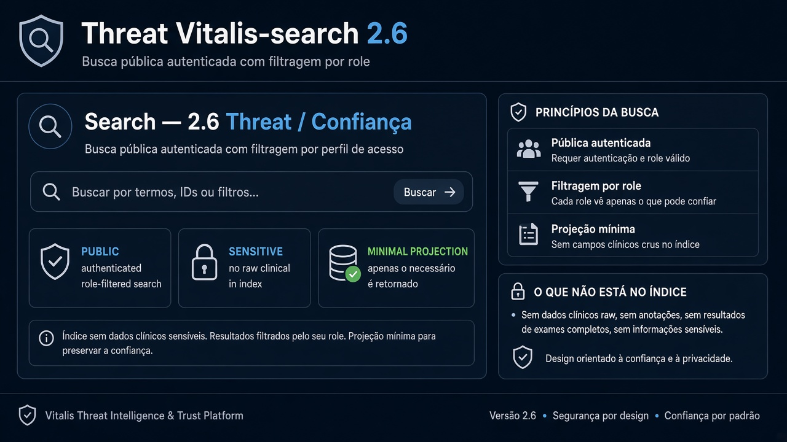

# Vitalis-search — Diagramas 2.1 → 2.6

| Campo | Valor |
|---|---|
| Repo | `Vitalis-search` |
| Porta | `8090` |
| DB | `pg_search` (ou OpenSearch depois) |

---

## 2.1 Componentes

**Imagem:** search-2.1-components.png

HTTP Query API · Indexer worker · Adapters eventos (Clinical/Commerce/Support) · Postgres full-text (fase 1) / OpenSearch (fase 2)

---

## 2.2 Contexto

**Imagem:** search-2.2-context.png

| Dir | Parceiro | Tipo | Uso |
|---|---|---|---|
| ← | Gateway | sync | busca unificada |
| ← | Clinical/Commerce/Support | async | indexar |
| — | não é source of truth | — | só índice |

---

## 2.3 ER

**Imagem:** search-2.3-er.png

- `search_documents` (id, type, title, body, ref_id, payload jsonb)
- `search_index_meta` (cursor eventos)

---

## 2.4 State

**Imagem:** search-2.4-state.png

Documento índice: `active` | `tombstoned`

---

## 2.5 Sequência — Buscar médico/produto

**Imagem:** search-2.5-sequence.png

1. GET `/v1/search?q=`  
2. Full-text em `search_documents`  
3. Retorna refs tipadas  

---

## 2.6 Threat

**Imagem:** search-2.6-threat.png

| | |
|---|---|
| Público | busca autenticada (filtrar por papel) |
| Sensível | não indexar dado clínico bruto desnecessário |
| Controles | projection mínima no índice |
