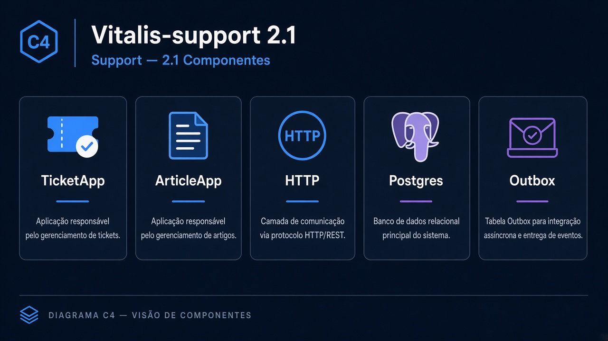
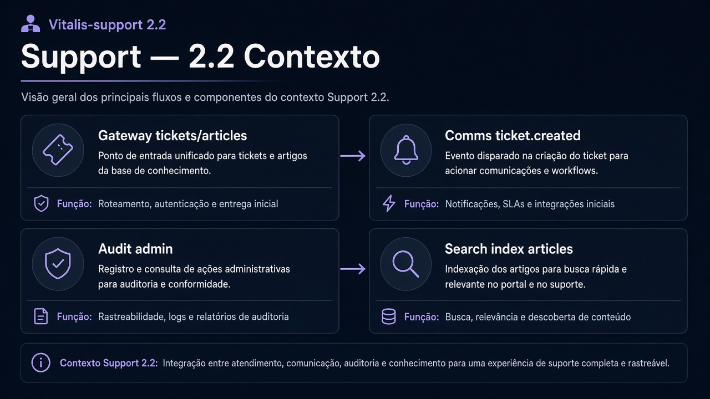
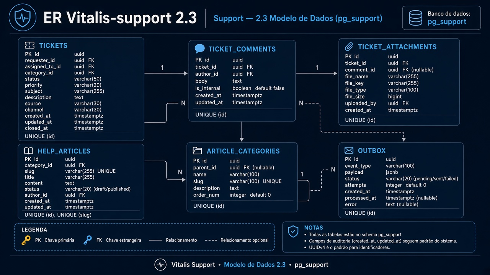
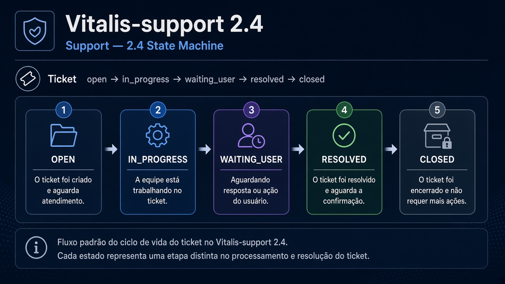
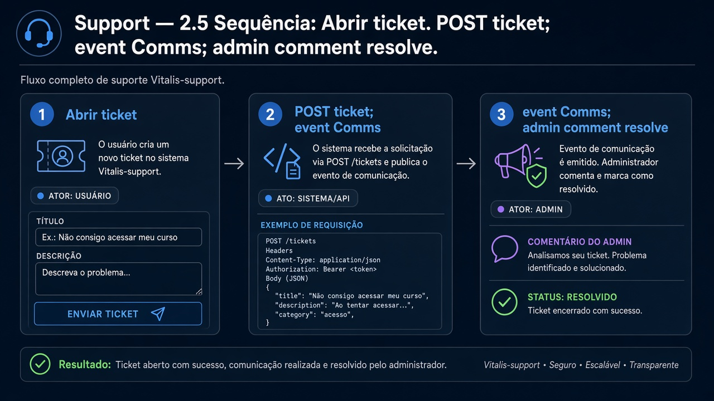
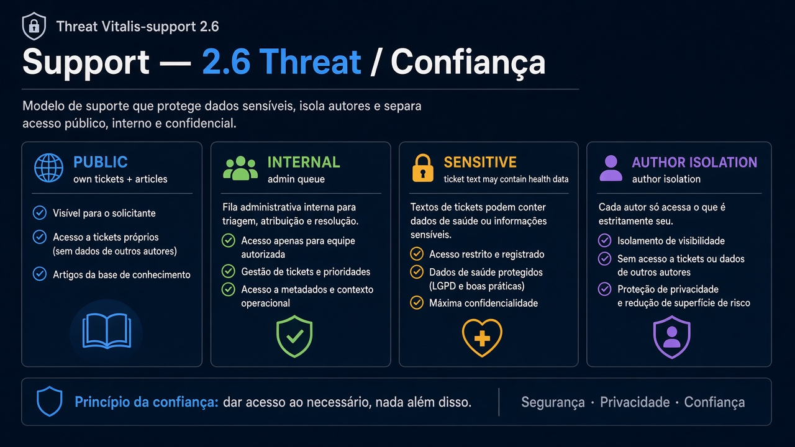

# Vitalis-support — Diagramas 2.1 → 2.6

| Campo | Valor |
|---|---|
| Repo | `Vitalis-support` |
| Porta | `8088` |
| DB | `pg_support` |

---

## 2.1 Componentes

**Imagem:** support-2.1-components.png

HTTP API · TicketApp · ArticleApp · Postgres · Outbox

---

## 2.2 Contexto

**Imagem:** support-2.2-context.png

| Dir | Parceiro | Tipo | Uso |
|---|---|---|---|
| ← | Gateway | sync | tickets/artigos |
| → | Comms | async | `ticket.created/resolved` |
| → | Audit | async | ações admin |
| → | Search | async | indexar artigos |

---

## 2.3 ER

**Imagem:** support-2.3-er.png

- `tickets`, `ticket_comments`, `ticket_attachments` (ref Files)
- `help_articles`, `article_categories`
- `outbox_events`

---

## 2.4 State — Ticket

**Imagem:** support-2.4-state.png

`open` → `in_progress` → `waiting_user` → `resolved` → `closed`

---

## 2.5 Sequência — Abrir ticket

**Imagem:** support-2.5-sequence.png

1. POST ticket  
2. Evento → Comms notifica suporte  
3. Admin comenta → resolve  

---

## 2.6 Threat

**Imagem:** support-2.6-threat.png

| | |
|---|---|
| Público | abrir ticket próprio; ler artigos |
| Interno | fila admin |
| Sensível | texto pode conter dado de saúde — cuidado |
| Controles | autor só vê próprios tickets |
